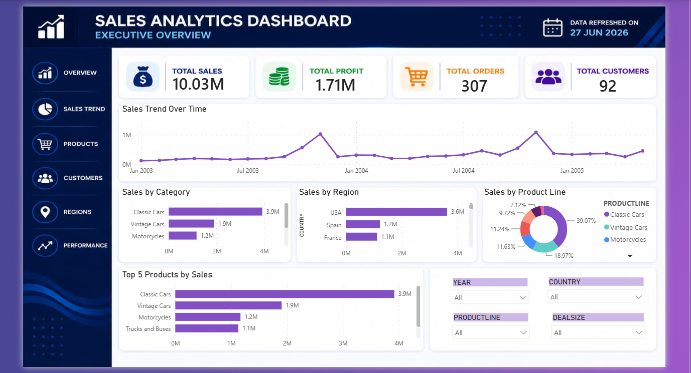
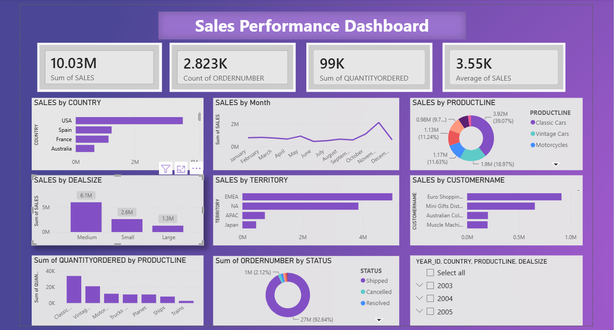
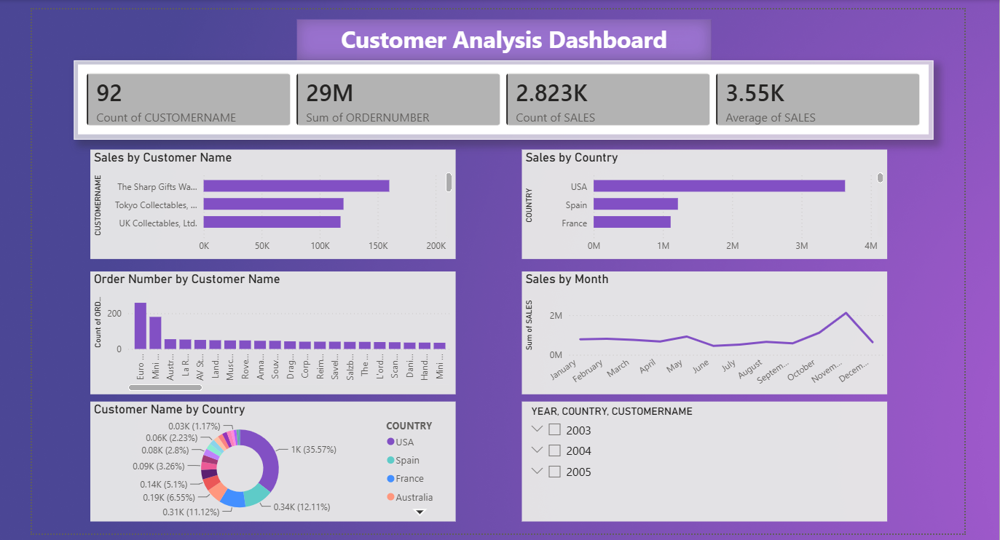
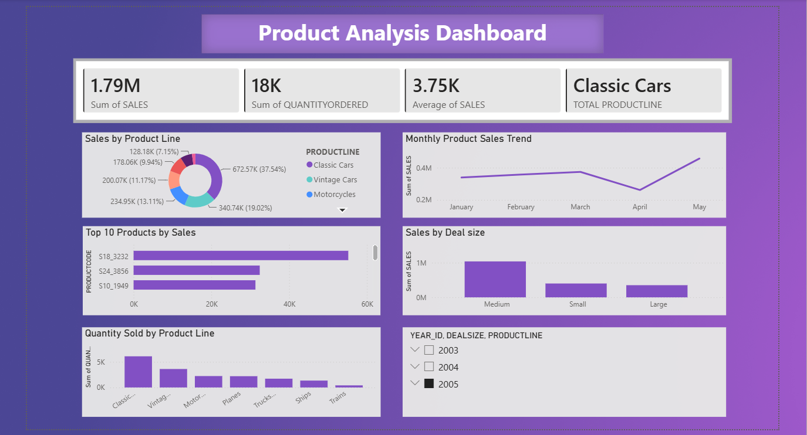

# 📊 Sales Data Analysis Dashboard

## 📌 Project Overview

The Sales Data Analysis Dashboard is an interactive Business Intelligence project developed using Power BI to analyze sales data and generate meaningful business insights. The dashboard enables users to monitor key performance indicators (KPIs), track sales trends, analyze customer behavior, evaluate product performance, and support data-driven decision-making.

This project demonstrates the complete dashboard development process, including data visualization, KPI creation, interactive filtering, and business reporting.

---

## 🎯 Business Objectives

- Analyze overall sales performance.
- Monitor monthly sales trends.
- Identify top-performing customers and products.
- Compare sales across countries and territories.
- Evaluate product line performance.
- Build an interactive dashboard to support business decisions.

---

## 🛠️ Tools & Technologies

- Power BI
- Microsoft Excel (CSV Dataset)
- GitHub

---

## 📊 Dashboard Pages

### 📍 Executive Overview
- Total Sales
- Total Orders
- Total Quantity Ordered
- Average Sales
- Monthly Sales Trend
- Sales by Country
- Top Customers
- Product Line Analysis

### 📍 Sales Performance
- Sales by Country
- Sales by Product Line
- Sales by Deal Size
- Monthly Sales Trend
- Interactive Filters

### 📍 Customer Analysis
- Top Customers
- Customer Sales Analysis
- Country-wise Customer Performance
- Customer Order Analysis

### 📍 Product Analysis
- Product Line Performance
- Top Selling Products
- Quantity Ordered Analysis
- Product Sales Trends

---

## 📈 Key Performance Indicators (KPIs)

- Total Sales
- Total Orders
- Total Quantity Ordered
- Average Sales

---

## ✨ Dashboard Features

- Interactive KPI Cards
- Line Charts
- Bar Charts
- Column Charts
- Donut Charts
- Interactive Slicers
- Business Insights
- User-friendly Dashboard Design

---

## 💡 Skills Demonstrated

- Data Cleaning
- Data Visualization
- Dashboard Design
- KPI Development
- Business Intelligence
- Data Analysis
- Power BI
- Data Storytelling

---

## 📂 Dataset

Sales Sample Dataset (CSV)

---
## 📷 Dashboard Preview

### 📍 Executive Overview

---

### 📍 Sales Performance

---

### 📍 Customer Analysis

---

### 📍 Product Analysis

---

## 👩‍💻 Author

**Priyanka Male**

Aspiring Data Analyst

**Skills:** SQL | Excel | Power BI | Python

GitHub: https://github.com/malepriyanka2003

LinkedIn: https://www.linkedin.com/in/mpriyanka03
